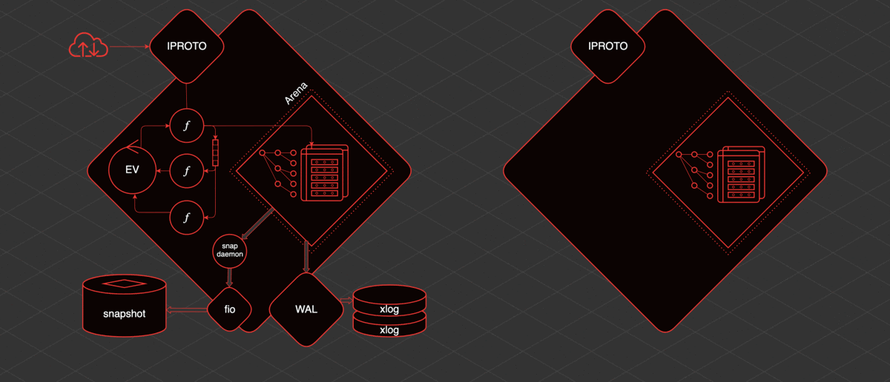
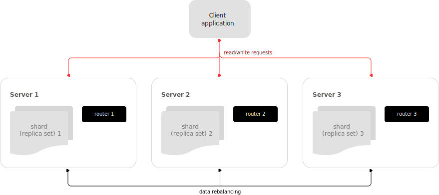

# Tarantool: persistent in-memory NoSql DB
---

# Overview

- Easy handling of OLTP workloads: processes hundreds of thousands RPS
- Data integrity: write-ahead log (WAL) and data snapshots
- Cooperative multitasking: transactions are performed in lightweight coroutines with no interthread locking
- Advanced indexing: composite indexes, locale support, indexing by nested fields and arrays
- Compute close to data: Lua server and Just-In-Time compiler on board
- Durable distributed storage: multiple failover modes and RAFT-based synchronous replication available

---

# History

- 2008 - Mail.ru Group has started developing a software product for its internal needs and its own services
- 2014 - participation in 1st official independent test on the performance of NoSQL-DBMS, best results in 4/5 tests for processing 600 thousand records under load
- 2016 – Mail.ru Group has published the Tarantool source code in the public domain under the BSD license
- 2019 – Arenadata, the developer of the first domestic distribution of Apache Hadoop and other Big Data Solutions, based on Tarantool created its own resident computing platform – Arenadata Grid
- 2021 - more than DB: BigData middleware

---

# Facts

- Written in C
- 2 database engines: 
    - memtx — in-memory engine (default)
    - vinyl — disk engine
- built-in Lua support (JIT compiler), code-to-data

---

# Basic concepts

- Tarantool operates data in the form of *tuples*
- Tuple contain *fields*
- Tuples are stored in *space*
- *Cooperative multitasking*: *fibers*, *yield* signals

---

# Tools and interaction

1. Interactive console (tarantoolctl) - prompt supports SQL / Lua requests with YAML-formatted results
```yaml
-- Interactive console example with Lua input and YAML output
tarantool> box.info().replication
---
- 1:
    id: 1
    uuid: a5d22f66-2d28-4a35-b78f-5bf73baf6c8a
    lsn: 0
...
```
---

# Tools and interaction

2. Cartridge CLI - prompt for Tarantool application instances control. It can create, build, locally run, pack application into RPM / Docker / TGZ, get logs, connect to instance, repair, configure failover, replica sets and some other features.
3. tt CLI - a utility that provides a unified command-line interface for managing Tarantool-based applications. It covers a wide range of tasks – from installing a specific Tarantool version to managing remote instances and developing applications.

---

# Data operations: overview

The basic data operations supported in Tarantool are:
- five data-manipulation operations (INSERT, UPDATE, UPSERT, DELETE, REPLACE), and
- one data-retrieval operation (SELECT).

Lua is mostly used for queries, but Tarantool also support SQL.

---

# Data operations: examples

```lua
-- INSERT
box.space.tester:insert{999, 'Taranto'}

-- UPDATE
box.space.tester:update({999}, {{'=', 2, 'Tarantino'}})

-- UPSERT
box.space.tester:upsert({999, 'Taranted'}, {{'=', 2, 'Tarantism'}})

-- REPLACE
box.space.tester:replace{999, 'Tarantella', 'Tarantula'}

-- SELECT
box.space.tester:select{999}

-- DELETE
box.space.tester:delete{999}
```

---

# Core implementation

- data access from only one thread - WAL thread
- transaction thread (TX thread): fibers & event loop
- iproto thread: communication with user
- snapshot daemon
- relay thread: deliver changes to replicas
- fiber applier: apply changes from remote node
- thread pool for file IO (fio library)

---

# Core implementation



---

# Indexes: overview

- May be primary or secondary
- May be multi-part
- Have one of 4 types: TREE, HASH, BITMAP and RTREE (for spatial data)
- May be unique (restriction)
- Field types (unsigned, integer, string, etc.) restrict values set

---

# Indexes: example (create index)

```lua
my_space = box.schema.create_space("tester")

my_space:format({
    { type = 'number', name = 'id' },
    { type = 'array', name = 'content' }
})

hash_index = my_space:create_index(
    'primary', { type = 'TREE', parts = {'id'} }
)

rtree_index = my_space:create_index(
    'spatial', { type = 'RTREE', unique = false, parts = {'content'} }
)
```

---

# Indexes: example (neighbor iterator)

```lua
tarantool> for i=1,10 do
         >    for j=1,10 do
         >        my_space:insert{i*10+j, {i, j, i+1, j+1}}
         >    end
         > end
---
...
tarantool> rtree_index:select({1, 1}, {iterator = 'neighbor', limit = 5})
---
- - [11, [1, 1, 2, 2]]
  - [12, [1, 2, 2, 3]]
  - [21, [2, 1, 3, 2]]
  - [22, [2, 2, 3, 3]]
  - [31, [3, 1, 4, 2]]
...
```

---

# Transactions: isolation levels

By default, transactions have *serializable* isolation level. It has some limitations:
- You cannot use interactive transactions
- Any fiber yield leads to abort the transaction
- All changes are made immediately, but in the event of a yield or error, the transaction is rolled back, including the return of the previous data
- Transaction manager is disabled
- If an error occured during writing to WAL, isol. level becomes *read commited*
---

# Transactions: isolation levels

Since version 2.6.1, Tarantool has transaction behaviour mode that allows yielding inside memtx transaction, which is controlled by transaction manager. To enable do:
```lua
box.cfg{memtx_use_mvcc_engine = true}
```
Since v. 2.10.0, IPROTO implements streams and interactive transactions.

---

# Sharding: overview

Tarantool support **horizontal** sharding via VShard module. It provides:
- locality
- atomic resharding
- read failover (write failover must be done manually)
- virtual sharding

---

# Sharding: architecture

Components:
- Storage - a node storing a subset of the dataset
- Router - a standalone software component that routes read and write requests from the client application to shards
- Rebalancer - a background rebalancing process that ensures an even distribution of buckets across the shards

---

# Sharding: architecture



---

# Failover: overview

An important topology parameter is the **failover priority** within a replica set. This is an ordered list of instances. By default, the first instance in the list becomes a leader, but with the failover enabled it may be changed automatically if the first one is malfunctioning. The failover is configured by specifying failover mode, mode-special settings, and fencing params. Fencing is a mechanism that enforces at-most-one leader policy in a replicaset.

---

# Failover: configuration

There are 4 supported failover modes in Tarantool:
1. **Disabled:** the leader is always the first instance in the failover priority.
2. **Eventual failover:** the first *healthy* instance from list is the leader, *health* is determined according to SWIM protocol.
3. **Stateful failover:** Similarly to the eventual mode, , but the map is fetched from an external state provider (etcd, or Tarantool's standalone stateboard).
4. **Raft failover (beta):** the replicaset leader is chosen by built-in Raft, then the other replicasets get information about leader change from membership.

---

# Tarantool & OLAP

Since Tarantool is row-oriented DB, it is bad for OLAP. What about data mining, there is a solution [Tarantool Data Grid](https://www.tarantool.io/en/datagrid/) in Tarantool Ecosystem.

---

# Security

Tarantool Enterprise has the following built-in security features:
- password-based / third-party authentication
- access control: roles, owners and privileges
- audit log: auth success / fail, changes of password, etc.
- traffic encryption: OpenSSL lib, TLSv1.2 only

---

# Community

- Tarantool is open-source project developed by VK Tech and community. GitHub repository has about 150 contributors who are experianced programmers, not only from VK Tech.

- VK Tech is a big IT company with 20+ years of highload experience and 100+ million users, that creates highly competitive solutions, that are well documented and have large community.

---

# How to dive in?

You can try official Tarantool sandbox, or import any public CSV database using command `tt crud import`. Example:
```shell
./tt crud import localhost:3301 ./Employees.csv mytestspace --username=guest --operation=insert
```

---

# How to dive in?

1. [Try Tarantool sandbox](https://try.tarantool.io/en?_ga=2.128100044.1163872072.1683550109-2017423719.1682953577)
2. [Getting started](https://www.tarantool.io/ru/doc/1.10/getting_started/)
3. [Tutorials](https://www.tarantool.io/ru/doc/1.10/tutorials/)
4. [Paid official training cources](https://www.tarantool.io/ru/trainings/)

---

# News, releases, Q&A

- [Telegram news channel](https://t.me/tarantool_news)
- Telegram Chat: [RU](https://t.me/tarantoolru), [EN](https://t.me/tarantool)
- [Stack Overflow tag](https://stackoverflow.com/questions/tagged/tarantool)
- [Habr](https://habr.com/ru/hub/tarantool/)

---

# Sources

- [Official Documentation](https://www.tarantool.io/en/doc/latest/)
- [Архитектура in-memory СУБД: 10 лет опыта в одной статье](https://habr.com/ru/companies/vk/articles/562192/)
- [Как работать с Tarantool на Golang вместо Lua](https://habr.com/ru/companies/vk/articles/574542/)